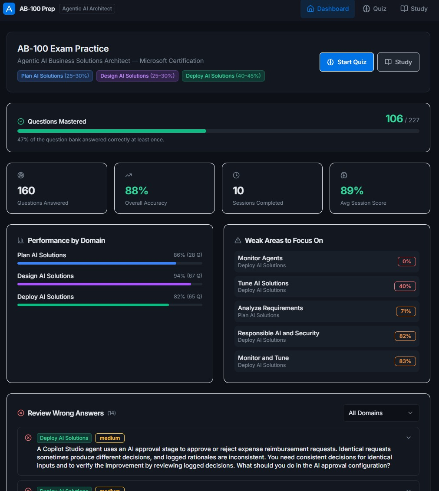

# AB-100 Exam Practice Tool

A full-stack practice app for the **Microsoft AB-100 — Agentic AI Business Solutions Architect** certification exam.

[](https://github.com/eugnmueller-87/Exam-Prep/actions/workflows/ci.yml)
[](https://opensource.org/licenses/MIT)


[](https://exam-prep-production-c476.up.railway.app)

**🔗 Live demo: [exam-prep-production-c476.up.railway.app](https://exam-prep-production-c476.up.railway.app)** — works on desktop, iPad, and mobile.



## Features

- **Quiz Mode** — Practice sessions with configurable domain, difficulty, and question count. Answer selection, instant feedback, and detailed explanations. Answer options are randomized on every question.
- **Study Mode** — Browse all questions grouped by topic. Expand any question and reveal the correct answer with explanation at your own pace.
- **Dashboard** — Track a **Questions Mastered** tracker (unique questions answered correctly at least once, out of the whole bank), overall accuracy, session scores, per-domain performance, and your weakest topics.
- **Review Wrong Answers** — Revisit the questions you most recently got wrong, filtered by domain. Self-clears as you answer them correctly.

## Exam Coverage

All three domains from the [official AB-100 study guide](https://learn.microsoft.com/en-gb/credentials/certifications/resources/study-guides/ab-100), with **227 questions** across every study-guide skill bullet — including real exam-style scenario questions:

| Domain                               | Weight | Questions |
| ------------------------------------ | ------ | --------- |
| Plan AI-powered business solutions   | 25–30% | 78        |
| Design AI-powered business solutions | 25–30% | 81        |
| Deploy AI-powered business solutions | 40–45% | 68        |

Topics covered include: multi-agent architecture, Copilot Studio, Microsoft Foundry, A2A & MCP protocols, model router modes, ALM for agents, Responsible AI, data residency, prompt injection, ROI analysis, Azure Monitor diagnostics, and more.

## Tech Stack

- **Frontend**: React + TypeScript + Vite + Tailwind CSS + shadcn/ui (mobile-first, iPad-friendly)
- **Backend**: Express.js + SQLite via Node's built-in [`node:sqlite`](https://nodejs.org/api/sqlite.html) (no native compiler needed)
- **State**: TanStack Query
- **Quality**: ESLint + Prettier + `tsc`, enforced in GitHub Actions CI

> Schema/types use `drizzle-orm` + `drizzle-zod` (pure-JS) for table definitions and request validation; the runtime query layer uses `node:sqlite` directly.

## Local Development

```bash
npm install
npm run dev          # http://localhost:5000 (Vite HMR)
```

## Production Build & Run

```bash
npm run build
npm start            # serves API + frontend on PORT (default 5000)
```

The question bank seeds automatically on first run (227 questions). Progress and
session history persist in SQLite (`data.db`, or `DATABASE_PATH` if set).

**Requires Node.js ≥ 22.5** (for stable `node:sqlite`). Node 24 recommended.

## Running on an iPad / Deploying

See **[DEPLOY.md](DEPLOY.md)** for:

- Running on the same Wi-Fi as your iPad (LAN access)
- Deploying a public URL to use the app anywhere, including while travelling —
  configured for **Railway** (`railway.json` + `nixpacks.toml`, recommended) and
  **Render** (`render.yaml`)

## Quality Checks

```bash
npm run check        # typecheck + lint + format check (matches CI)
npm run lint:fix     # auto-fix lint
npm run format       # auto-format
```

## Project Structure

```
client/          # React frontend
  src/
    pages/       # Dashboard, Quiz, Study, Results
    components/  # Layout, shared UI (shadcn/ui)
    lib/         # API client, query setup
server/          # Express backend
  routes.ts      # API endpoints
  storage.ts     # node:sqlite data layer
  questions-seed.ts  # 227 exam questions with explanations
shared/
  schema.ts      # table definitions + Zod schemas
.github/workflows/ci.yml   # typecheck + lint + format + build on push/PR
render.yaml      # Render deploy blueprint
```
